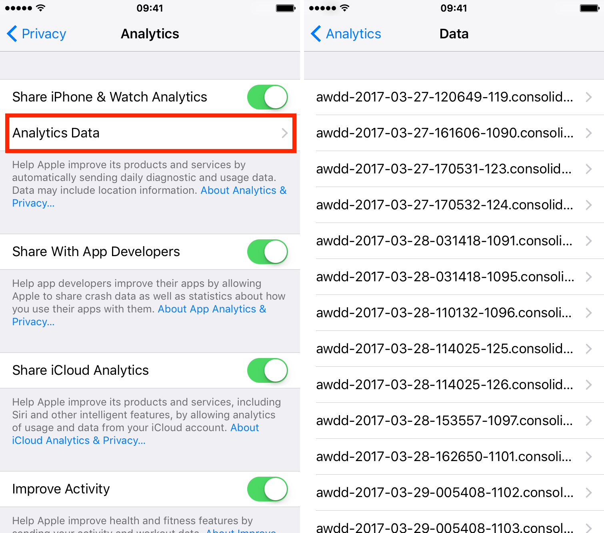
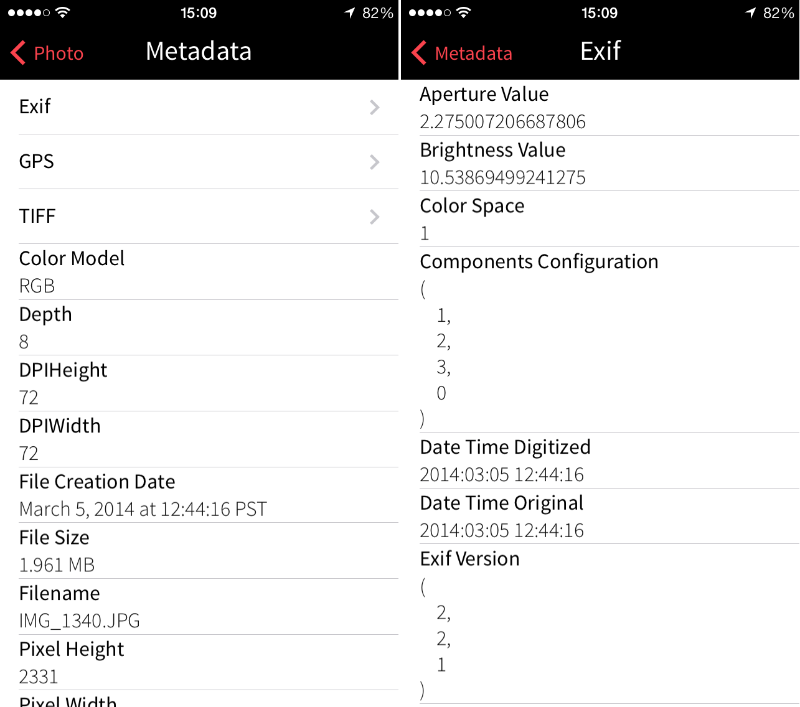

# IPHONE-analytics_data

Apple uses a variety of algorithms to collect and analyze analytics data on iPhone. Some of the algorithms that Apple uses include:

* **Differential privacy:** This algorithm is used to protect the privacy of users while still allowing Apple to collect and analyze analytics data. Differential privacy works by adding noise to the data, which makes it difficult to identify individual users.
* **Machine learning:** Apple uses machine learning algorithms to identify patterns in analytics data. These patterns can be used to improve the iPhone's performance, reliability, and features.
* **Natural language processing:** Apple uses natural language processing algorithms to analyze text data. This data can be used to improve the iPhone's keyboard, search, and other features.
* **Image recognition:** Apple uses image recognition algorithms to analyze images. This data can be used to improve the iPhone's camera, photo app, and other features.

* **Privacy:** Algorithms can be used to protect the privacy of users while still allowing Apple to collect and analyze analytics data.
* **Accuracy:** Algorithms can be used to identify patterns in analytics data that would be difficult to identify manually.
* **Efficiency:** Algorithms can be used to collect and analyze analytics data more efficiently than manual methods.

However, there are also some challenges associated with using algorithms to collect and analyze analytics data on iPhone:

* **Complexity:** Algorithms can be complex to develop and maintain.
* **Bias:** Algorithms can be biased, which can lead to inaccurate results.
* **Interpretability:** It can be difficult to interpret the results of algorithms.

Overall, algorithms can be a valuable tool for collecting and analyzing analytics data on iPhone. However, it is important to be aware of the challenges associated with using algorithms.

  

Sure, here are some examples of analytics data that could be collected for iPhone images:

Image metadata: This data includes information about the image, such as the file name, the date and time the image was taken, the camera settings that were used, and the location where the image was taken.
Image usage data: This data includes information about how the image is used, such as the number of times the image has been viewed, the number of times the image has been shared, and the number of times the image has been downloaded.
Image engagement data: This data includes information about how people interact with the image, such as how long people spend looking at the image, how often people zoom in on the image, and how often people tap on the image.

  

Privacy concerns: Some people may be concerned about the privacy implications of collecting analytics data about their images.
Security concerns: There is a risk that analytics data about images could be hacked or used for malicious purposes.
Data storage costs: Analytics data about images can be very large, which can make it expensive to store.
Overall, analytics data for iPhone images can be a valuable tool for improving the iPhone's image features, personalizing the iPhone experience, and improving the quality of images that are taken with the iPhone's camera. However, it is important to be aware of the privacy and security implications of collecting analytics data about images.

<h2> ANALYTICS DATA IMAGE (EXAMPLE)</h2>

  

